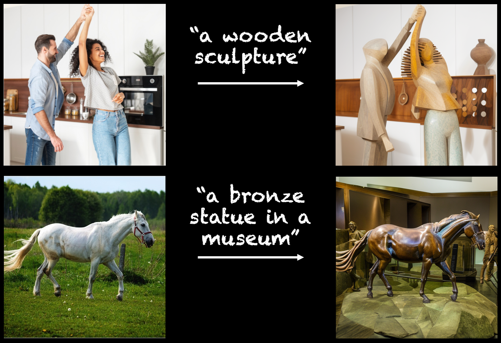

# Plug-and-Play Diffusion Features for Text-Driven Image-to-Image Translation (CVPR 2023)

## [<a href="https://pnp-diffusion.github.io/" target="_blank">Project Page</a>]

[](https://arxiv.org/abs/2211.12572) [](https://huggingface.co/spaces/hysts/PnP-diffusion-features) <a href="https://replicate.com/arielreplicate/plug_and_play_image_translation"></a> [](https://www.dropbox.com/sh/8giw0uhfekft47h/AAAF1frwakVsQocKczZZSX6La?dl=0)




**To plug-and-play diffusion features, please follow these steps:**

1. [Setup](#setup)
2. [Latent extraction](#latent-extraction)
3. [Running PnP](#running-pnp)


## Setup

Create the environment and install the dependencies by running:

```
conda create -n pnp-diffusers python=3.9
conda activate pnp-diffusers
pip install -r requirements.txt
```


## Latent Extraction

We first compute the intermediate noisy latents of the structure guidance image. To do that, run:

```
python preprocess.py --data_path <path_to_guidance_image> --inversion_prompt <inversion_prompt>
```

where `<inversion_prompt>` should describe the content of the guidance image. The intermediate noisy latents will be saved under the path `latents_forward/<image_name>`, where `<image_name>` is the filename of the provided guidance image.


## Running PnP

Run the following command for applying PnP on the structure guidance image:

```
python pnp.py --config_path <pnp_config_path>
```

where `<pnp_config_path>` is a path to a yaml config file. The config includes fields for providing the guidance image path, the PnP output path, translation prompt, guidance scale, PnP feature and self-attention injection thresholds, and additional hyperparameters. See an example config in `config_pnp.yaml`.


## Citation
```
@InProceedings{Tumanyan_2023_CVPR,
    author    = {Tumanyan, Narek and Geyer, Michal and Bagon, Shai and Dekel, Tali},
    title     = {Plug-and-Play Diffusion Features for Text-Driven Image-to-Image Translation},
    booktitle = {Proceedings of the IEEE/CVF Conference on Computer Vision and Pattern Recognition (CVPR)},
    month     = {June},
    year      = {2023},
    pages     = {1921-1930}
}
```
